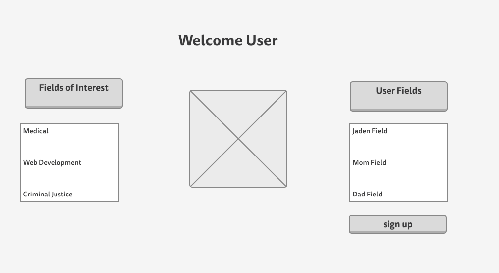
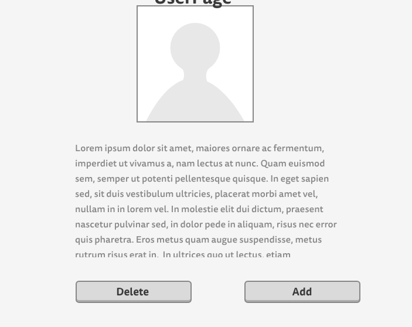
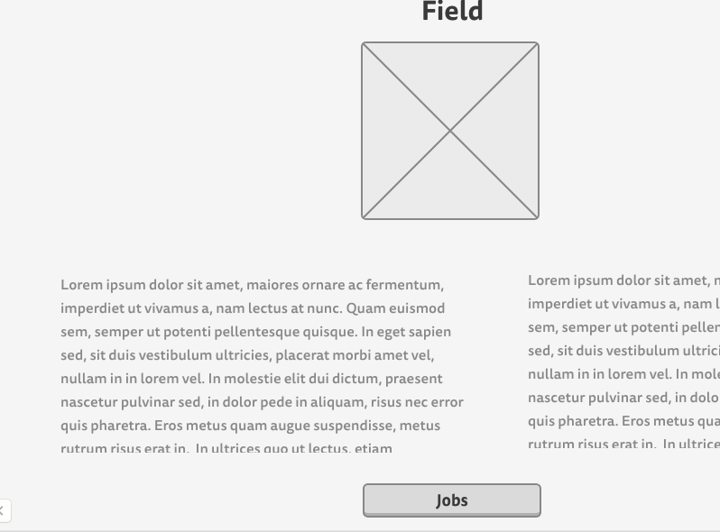
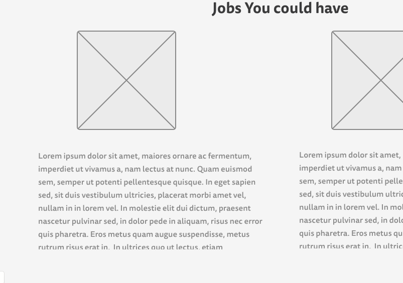

# Project3

# Heroku 
https://ancient-brushlands-92129.herokuapp.com/

# About My App
The app I made helps you get smarter with your choices. This app will help you to see different job fields and find out what routes to take to get into them. In this project I used Express, React, Mongo, and Node. This is one of my favorite project ideas.

# Wireframes 

# Erd 

# Trello 
https://trello.com/b/rw2MBdPh/project-3-app

 

