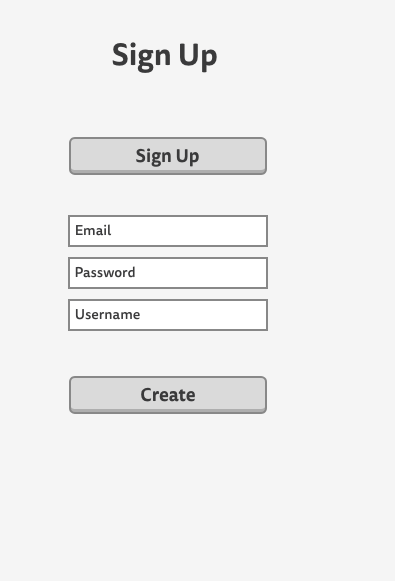

# Project3

# Heroku 
https://ancient-brushlands-92129.herokuapp.com/

# Wireframes 

# Erd 

# Trello 
https://trello.com/b/rw2MBdPh/project-3-app

# About My App
The app I made a get smart app. This app will help you to see different job fields and find out what routes to take to get into them. In this app I use Express, React, Mongo, and Node. This is one of my favorite project ideas. 

